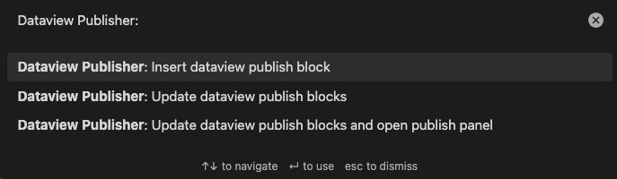

# Datacore Publisher

## Overview

Output markdown from your [Datacore](https://github.com/blacksmithgu/datacore) queries and keep them up to date.
You can also be able to [publish](https://obsidian.md/publish) them.

## Screenshots


## Prerequisites

This plugin uses the following two plugins, so you must install them:

- [Datacore](https://github.com/blacksmithgu/datacore)
- [Publish](https://obsidian.md/publish) (Core Plugin)

## Installation

### Installing the plugin using BRAT

1. Install the BRAT plugin
    1. Open `Settings` -> `Community Plugins`
    2. Disable safe mode, if enabled
    3. *Browse*, and search for "BRAT" 
    4. Install the latest version of **Obsidian 42 - BRAT**
2. Open BRAT settings (`Settings` -> `Obsidian 42 - BRAT`)
    1. Scroll to the `Beta Plugin List` section
    2. `Add Beta Plugin`
    3. Specify this repository: `udus122/dataview-publisher`
3. Enable the `Datacore Publisher` plugin (`Settings` -> `Community Plugins`)

## Usage

The `datacore` plugin is a powerful tool for querying your notes, but its modern rendering engine produces interactive tables and lists that are not compatible with Obsidian Publish. This plugin bridges that gap by allowing you to execute `datacore` queries and render the output as static markdown that can be published.

To use this plugin, you create a `datacorejs` code block inside a `DATACORE_PUBLISHER` block. The critical difference from a normal `datacore` query is that your code must **return a markdown string**.

````
%% DATACORE_PUBLISHER: start
\`\`\`datacorejs
// Your query must return a markdown string.
const pages = dc.query("your-query");
// ...process pages...
let markdown = "| Header 1 | Header 2 |\\n";
markdown +=    "|----------|----------|\\n";
for (const page of pages) {
    markdown += \`| \${page.field1} | \${page.field2} |\\n\`;
}
return markdown;
\`\`\`
%%
<Query results will be output as markdown here>
%% DATACORE_PUBLISHER: end %%
````

### Example

Here is an example that finds all tasks in your vault, and displays them in a markdown table.

````
%% DATACORE_PUBLISHER: start
\`\`\`datacorejs
const tasks = dc.query("@task");
let markdown = "| Task | File |\\n";
markdown +=    "|------|------|\\n";
for (const task of tasks) {
    markdown += \`| \${task.$text} | \${task.$file} |\\n\`;
}
return markdown;
\`\`\`
%%
| Task | File |
|------|------|
| Task 1 | file1.md |
| Task 2 | file2.md |
%% DATACORE_PUBLISHER: end %%
````

Datacore JS is executed using the [eval() function](https://developer.mozilla.org/en-US/docs/Web/JavaScript/Reference/Global_Objects/eval). the last expression or value evaluated is output (Leading and trailing whitespace and newlines will be trimmed).

You can use [`DatacoreAPI`](https://github.com/blacksmithgu/datacore) object as `dc` and [`TFile`](https://docs.obsidian.md/Reference/TypeScript+API/TFile) object of current file as `file`.

**Warning: It can be dangerous to execute arbitrary codes from untrusted sources. Only run codes that you understand, from trusted sources.**

### Settings


- Source: [Datacore source](https://blacksmithgu.github.io/datacore/) to search for the target file
  - This setting is used to narrow down the files to be updated, and is recommended for performance reasons
  - If left empty, this plugin will attempt to update all files in the Vault
- Update on save: Automatically update output when file is saved
  - Only the Saved file is updated.

### Commands



- Insert datacore publish block
  - Insert Datacore Publisher Template at next line of cursor
- Update datacore publish blocks
  - Update all Datacore Publish blocks for the files that correspond to the specified Source in settings.
- Update datacore publish blocks and open publish panel
  - Same as "Update datacore publish blocks" and open publish panel.

## Inspirations

This plugin highly inspired by this article.

[Using Dataview on Obsidian Publish](https://joschua.io/posts/2023/09/01/obsidian-publish-dataview)
